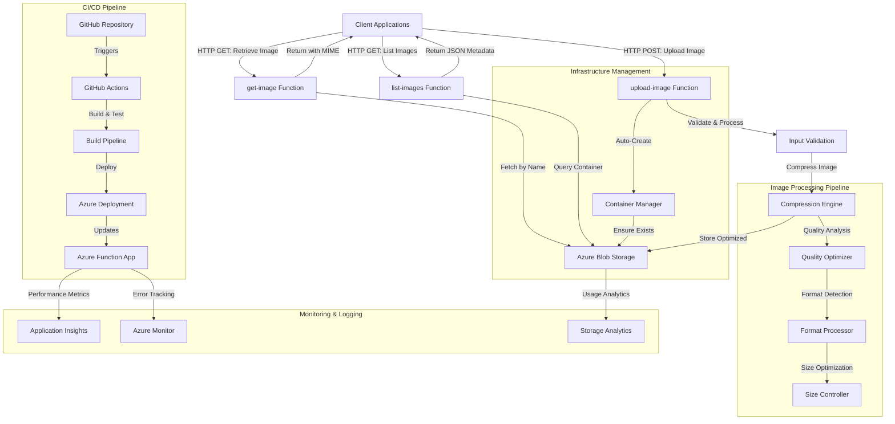
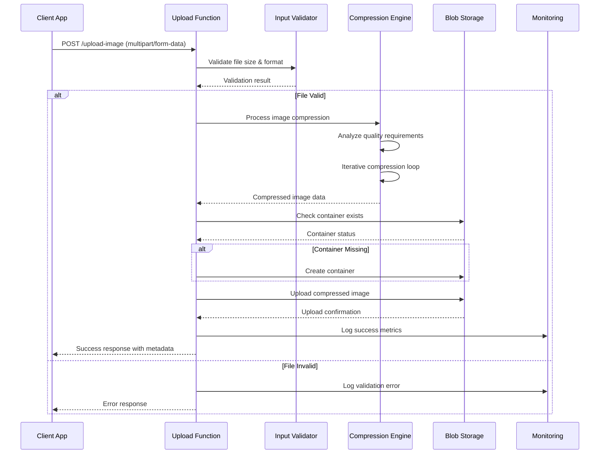
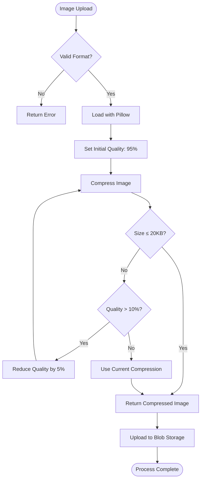

# 🏗️ Image Processor Function App Architecture

## 📖 Overview

This document describes the comprehensive architecture of the Image Processor Function App, a sophisticated serverless system designed for intelligent image processing, compression, and storage. The system implements advanced cloud-native patterns for scalable media handling, cost optimization, and high-performance image operations.

---

## 🏛️ High-Level Architecture

The architecture demonstrates enterprise-grade serverless patterns with intelligent media processing, automatic scaling, and comprehensive monitoring capabilities.

---

## 🧩 Core Components

### Image Upload Processor
- **Purpose**: Handles multipart file uploads with validation and processing
- **Technology**: Azure Functions HTTP Trigger with file handling
- **Location**: `function_app.py#upload_image`
- **Responsibilities**:
  - File validation and format verification
  - Size limit enforcement (10MB max)
  - Compression pipeline orchestration
  - Blob storage upload coordination
  - Error handling and logging

### Intelligent Compression Engine
- **Purpose**: Advanced image compression with quality optimization
- **Technology**: Pillow (PIL) library with custom algorithms
- **Location**: `function_app.py#compress_image`
- **Responsibilities**:
  - Adaptive quality adjustment (95% → 10% minimum)
  - Target size achievement (20KB default)
  - Format preservation when possible
  - Visual quality balance optimization
  - Iterative compression refinement

### Storage Management Service
- **Purpose**: Azure Blob Storage integration and container management
- **Technology**: Azure Storage SDK for Python
- **Location**: `function_app.py#ensure_container_exists`
- **Responsibilities**:
  - Dynamic container creation
  - Blob upload and retrieval operations
  - Storage metadata management
  - Access control and security
  - Cost optimization through compression

### Image Retrieval Service
- **Purpose**: Efficient image fetching with proper content delivery
- **Technology**: Azure Functions with HTTP binding
- **Location**: `function_app.py#get_image`
- **Responsibilities**:
  - Image retrieval by filename
  - MIME type detection and headers
  - Error handling for missing files
  - Performance optimization
  - Content delivery optimization

---

## 🔄 Data Flow & Processing Pipeline

### Image Upload Workflow

### Compression Algorithm Flow

---

## 📊 Image Processing Specifications

### Supported Formats & Capabilities

| Format | Input Support | Output Support | Compression | Transparency |
|--------|--------------|----------------|-------------|--------------|
| JPEG   | ✅ Full      | ✅ Full        | ✅ Lossy    | ❌ No        |
| PNG    | ✅ Full      | ✅ Full        | ✅ Lossless | ✅ Yes       |
| GIF    | ✅ Full      | ✅ Full        | ✅ LZW      | ✅ Yes       |
| TIFF   | ✅ Full      | ✅ Full        | ✅ Various  | ✅ Yes       |
| BMP    | ✅ Full      | ✅ Full        | ✅ RLE      | ❌ No        |

### Compression Parameters

- **Target Size**: 20KB maximum per image
- **Quality Range**: 95% (high) to 10% (minimum acceptable)
- **Quality Step**: 5% reduction per iteration
- **Max Iterations**: ~17 iterations maximum
- **Fallback**: Original compression if minimum quality reached

### Performance Characteristics

- **Upload Limit**: 10MB per file (before compression)
- **Processing Time**: ~2-5 seconds for average images
- **Compression Ratio**: Typically 80-95% size reduction
- **Concurrent Uploads**: Unlimited (Azure Functions auto-scaling)
- **Storage Efficiency**: Significant cost savings through optimization

---

## 🔒 Security Architecture

### Input Validation & Sanitization
- **File Type Validation**: Strict format verification using Pillow
- **Size Limits**: 10MB maximum upload to prevent abuse
- **Content Scanning**: Image header validation for security
- **Error Handling**: Secure error messages without information disclosure

### Storage Security
- **Access Control**: Azure Storage access keys and connection strings
- **Container Isolation**: Dedicated container for image files
- **Encryption**: Azure Storage encryption at rest and in transit
- **Backup Strategy**: Azure Storage redundancy options

### Function Security
- **Authentication**: Azure Functions authentication levels
- **Environment Variables**: Secure configuration management
- **Network Security**: VNet integration capabilities
- **Monitoring**: Comprehensive audit logging and alerting

---

## 🚀 Deployment & Scalability Architecture

### Serverless Scaling Characteristics
- **Auto-scaling**: Dynamic scaling based on request volume
- **Cold Start Optimization**: Efficient function initialization
- **Resource Allocation**: Optimal memory and CPU allocation
- **Cost Model**: Pay-per-execution pricing optimization

### CI/CD Pipeline Architecture
- **Source Control**: Git-based version control with GitHub
- **Build Process**: Automated dependency installation and validation
- **Testing**: Unit tests and integration testing automation
- **Deployment**: Blue-green deployment with rollback capabilities

### Performance Optimization
- **Memory Management**: Efficient image processing in memory
- **Connection Pooling**: Optimized Azure Storage connections
- **Caching Strategy**: Function-level caching for repeated operations
- **Error Recovery**: Robust retry mechanisms for transient failures

---

## 📈 Monitoring & Observability

### Application Monitoring
- **Performance Metrics**: Function execution time and success rates
- **Error Tracking**: Comprehensive exception logging and alerting
- **Usage Analytics**: Upload volume and compression effectiveness
- **Cost Monitoring**: Storage and compute cost tracking

### Storage Analytics
- **Blob Metrics**: Upload/download patterns and performance
- **Capacity Planning**: Storage growth and optimization opportunities
- **Access Patterns**: Popular image retrieval analytics
- **Cost Optimization**: Compression savings and storage efficiency

---

## 🔧 Technical Considerations

### Image Processing Optimization
- **Memory Efficiency**: Streaming processing for large images
- **Format-Specific Optimization**: Tailored compression per format
- **Quality Assessment**: Visual quality preservation algorithms
- **Batch Processing**: Potential for bulk image operations

### Storage Optimization
- **Container Strategy**: Organized blob naming and structure
- **Lifecycle Management**: Automated cleanup and archival policies
- **Access Patterns**: Hot/cool storage tier optimization
- **CDN Integration**: Content delivery network readiness

### Error Handling & Recovery
- **Graceful Degradation**: Fallback mechanisms for processing failures
- **Retry Logic**: Intelligent retry with exponential backoff
- **Circuit Breaker**: Protection against cascading failures
- **Data Validation**: Comprehensive input and output validation

---

*This architecture ensures reliable, scalable, and cost-effective image processing while maintaining high performance and security standards.*
   - Client sends HTTP POST with an image file
   - Function app validates and compresses the image
   - Compressed image is stored in Azure Blob Storage
   - Success/failure response is sent to the client

2. **Image Retrieval Process**:
   - Client sends HTTP GET request with image name
   - Function app retrieves the image from Azure Blob Storage
   - Image is returned to the client with appropriate MIME type

3. **Image Listing Process**:
   - Client sends HTTP GET request to list-images endpoint
   - Function app retrieves all blob names from the container
   - JSON list of available images is returned to the client
